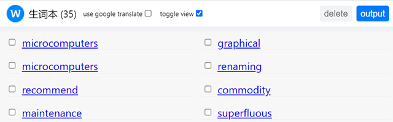

  

<h1 align="center">英语生词本 (English Vocabulary Book)</h1>

一个 Chrome 扩展，可以将不熟悉的英语单词收集到我的生词本中，收集的单词以后可以用来复习和记忆. 在网页中选择您要收集的单词，右键单击并在上下文菜单中选择 **添加到我的生词本** 菜单项.

A Chrome extension that collect unfamiliar english words to my vocabulary book, the collection words can be used to review and
memories later.

selection the word in the webpage that you want to collect, right click and select the **Add to my vocabulary book** menu item in the context menu.

## Install

[link-chrome]: https://chrome.google.com/webstore/detail/refined-github/hlepfoohegkhhmjieoechaddaejaokhf "Version published on Chrome Web Store"

download from Chrome web store [][link-chrome] [][link-chrome]

or download it from the [GitHub release]()

## 类别以及语言

- 类别: 生产工具
- 语言: 英语,汉语

## screenshot

  

## Privacy policy requirements of published to Chrome web store

#### single use

Only used to collect those unfamiliar English words in the web page, it is for learning purpose. select the word in the webpage that you interested, right click and select **Add to my vocabulary book** menu item in the context menu for later review and study.

#### why storage permission

The collected words must be accessed across multiple devices, and the data is always sync, so storage permission are need.

#### why contextMenus permission

In order to make it easier for users to add unfamiliar english word to my vocabulary book, context menu must have, because it improves the user experience of using the extension.

#### why notification permission

The notification gives the user response after some operations success or failed, it also gives users the best interactive experience of using extension.
